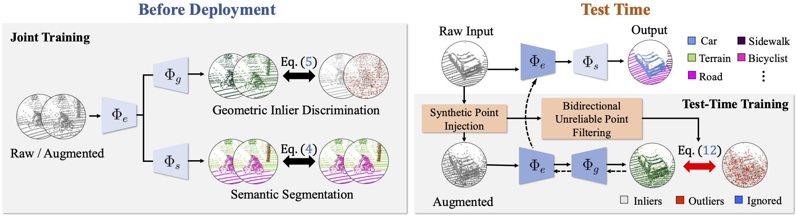

# GeoID

Official implementation of **"Test-Time Training for LiDAR Semantic Segmentation under Corruption via Geometric Inlier Discrimination"** (CVPR 2026).

Hyeonseong Kim\*, Hyun-Kurl Jang\*, Kuk-Jin Yoon — Visual Intelligence Lab., KAIST (\*equal contribution)

[[paper]](https://openaccess.thecvf.com/content/CVPR2026/papers/Kim_Test-Time_Training_for_LiDAR_Semantic_Segmentation_under_Corruption_via_Geometric_CVPR_2026_paper.pdf)

---

## Abstract

LiDAR semantic segmentation must remain robust under various sensor and environmental corruptions to be reliable in safety-critical applications. Existing test-time adaptation methods, including approaches based on pseudo-labels and normalization statistics, have shown promising results but can still struggle under severe distribution shifts. To complement these approaches, we propose a geometry-aware test-time training framework that leverages an auxiliary self-supervised objective. Our method is based on **geometric inlier discrimination (GeoID)**, which injects synthetic off-manifold points into the input and trains the model to distinguish geometry-consistent inliers from synthetically displaced outliers, enabling adaptation on unlabeled test data. To further stabilize this process under real corruptions, we introduce bidirectional unreliable point filtering (BiUPF), which uses inlier scores from the source-trained model to filter out unreliable regions on both original and synthetic data, focusing updates on high-confidence samples. Experiments on two large-scale corruption benchmarks, **SemanticKITTI-C** and **nuScenes-C**, show that our method consistently outperforms strong test-time adaptation baselines and improves robustness across diverse LiDAR corruptions.

<p align="center">
  
</p>

## Installation

Tested with Python 3.8, CUDA 11.1, PyTorch + [MinkowskiEngine 0.5.4](https://github.com/NVIDIA/MinkowskiEngine).

```bash
conda create -n geoid python=3.8 -y
conda activate geoid

# 1) PyTorch (match your CUDA toolkit)
pip install torch torchvision

# 2) MinkowskiEngine (see the official repo for build prerequisites)
pip install -U MinkowskiEngine --install-option="--blas=openblas" -v --no-deps

# 3) Remaining dependencies
pip install pytorch-lightning==1.6.5 torch-cluster \
            numpy scipy numba opencv-python matplotlib mlxtend \
            munch pyyaml tqdm nuscenes-devkit
```


## Data preparation

Place all datasets under `./data/` using the layout below:

```
data/
├── SemanticKITTI/        # SemanticKITTI
├── nuScenes/             # nuScenes
├── SemanticKITTI-C/      # SemanticKITTI corruption benchmark
└── nuScenes-C/           # nuScenes corruption benchmark
```

The configs in [configs/geoid/](configs/geoid/) already point at these `./data/...` paths:

| Dataset | Used for | Config key | Path |
|---|---|---|---|
| [SemanticKITTI](http://www.semantic-kitti.org/) | source training | `dataset_SemKITTI.data_path` | `./data/SemanticKITTI/sequences` |
| [nuScenes](https://www.nuscenes.org/) | source training | `dataset_nuScenes.data_path` | `./data/nuScenes` |
| [SemanticKITTI-C](https://github.com/worldbench/Robo3D) | corruption TTA | `dataset_SemKITTI_C.data_path` (+ `data_path_orig`) | `./data/SemanticKITTI-C` (`./data/SemanticKITTI/sequences`) |
| [nuScenes-C](https://github.com/worldbench/Robo3D) | corruption TTA | `dataset_nuScenes_C.data_path` (+ `data_path_orig`) | `./data/nuScenes-C` (`./data/nuScenes`) |

The corruption benchmarks cover 8 corruption types
(beam_missing, cross_sensor, crosstalk, fog, incomplete_echo,
motion_blur, snow, wet_ground) at 3 severity levels (light, moderate, heavy).


## Usage

### 1. Source training

Jointly trains semantic segmentation and the GeoID task on clean source data.

```bash
bash run_train_semkitti.sh   # train on SemanticKITTI
bash run_train_nusc.sh       # train on nuScenes
```

### 2. Test-time training

```bash
bash run_adapt_semkitti.sh   # SemanticKITTI → SemanticKITTI-C
bash run_adapt_nusc.sh       # nuScenes → nuScenes-C
```

## Citation

```bibtex
@inproceedings{kim2026geoid,
  title     = {Test-Time Training for LiDAR Semantic Segmentation under Corruption via Geometric Inlier Discrimination},
  author    = {Kim, Hyeonseong and Jang, Hyun-Kurl and Yoon, Kuk-Jin},
  booktitle = {Proceedings of the IEEE/CVF Conference on Computer Vision and Pattern Recognition (CVPR)},
  year      = {2026}
}
```

## Acknowledgements

This project builds on [MinkowskiEngine](https://github.com/NVIDIA/MinkowskiEngine)
and [PyTorch Lightning](https://github.com/Lightning-AI/pytorch-lightning), and uses
the SemanticKITTI / nuScenes datasets and their corruption benchmarks.

## License

Released under the [MIT License](LICENSE).
